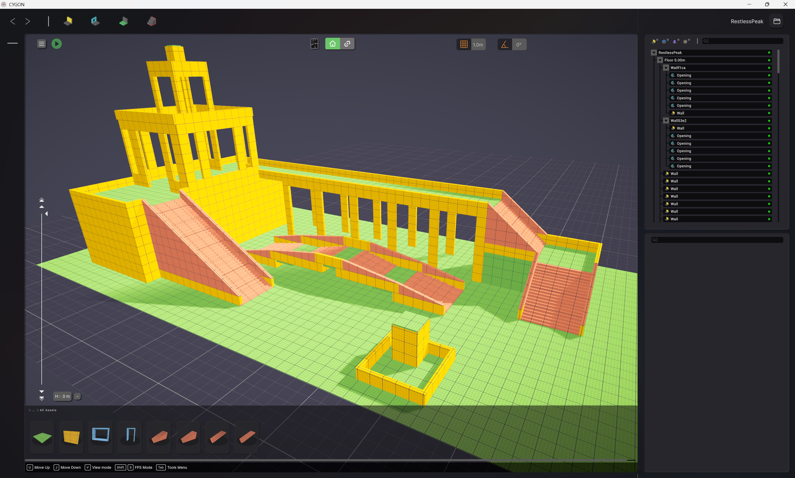
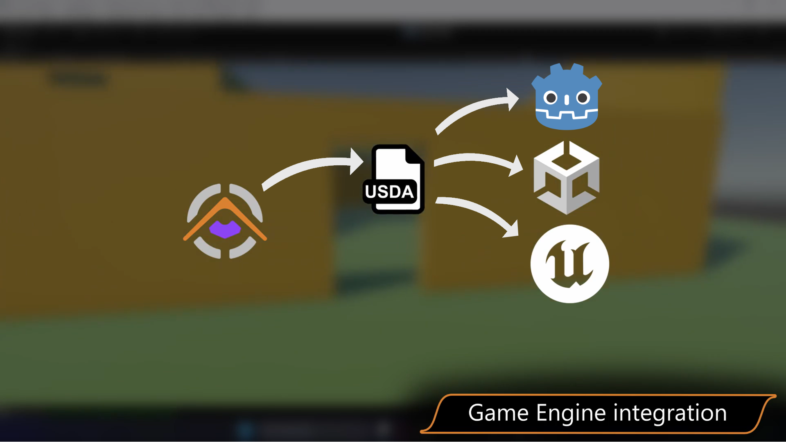

# What is Cygon?

Cygon is a **standalone 3D environment prototyping tool** developed by us, [Inspyr Studio](https://www.cygon.tech/about-us). It is designed to help artists and designers iterate rapidly on 3D environment layouts, a dedicated blockout tool that keeps the creative process fast, with less overhead.

Cygon Link is the bridge that brings your Cygon blockouts directly into Godot, reimporting them as you iterate.

## Key capabilities relevant to Cygon Link
- Exports 3D scenes in the **USDA** (Universal Scene Description ASCII) format.
- Organizes exported scenes as a hierarchy: a top-level `.usda` file referencing individual mesh files inside a `meshes/` subfolder, plus a `textures/` folder used by the materials.
- Supports quick export via **CTRL + S** or the export button in the Project Manager.

## Getting Cygon
> **Note:** Cygon is currently in **beta**. Access requires a paid subscription, available on the [Cygon pricing page](https://www.cygon.tech/pricing).

## Minimum version
Cygon **0.3.3** or higher is required for Cygon Link to work correctly. Earlier versions do not support the export pipeline expected by the plugin.

## How Cygon and Cygon Link work together
When you export a scene from Cygon, it writes a `.usda` file to disk. Cygon Link registers an `EditorImportPlugin` for `.usda` files inside your Godot project and imports them automatically, converting geometry, materials, and transforms into a native Godot `PackedScene`.

For the full workflow, see [Getting Started](GettingStarted.md).
